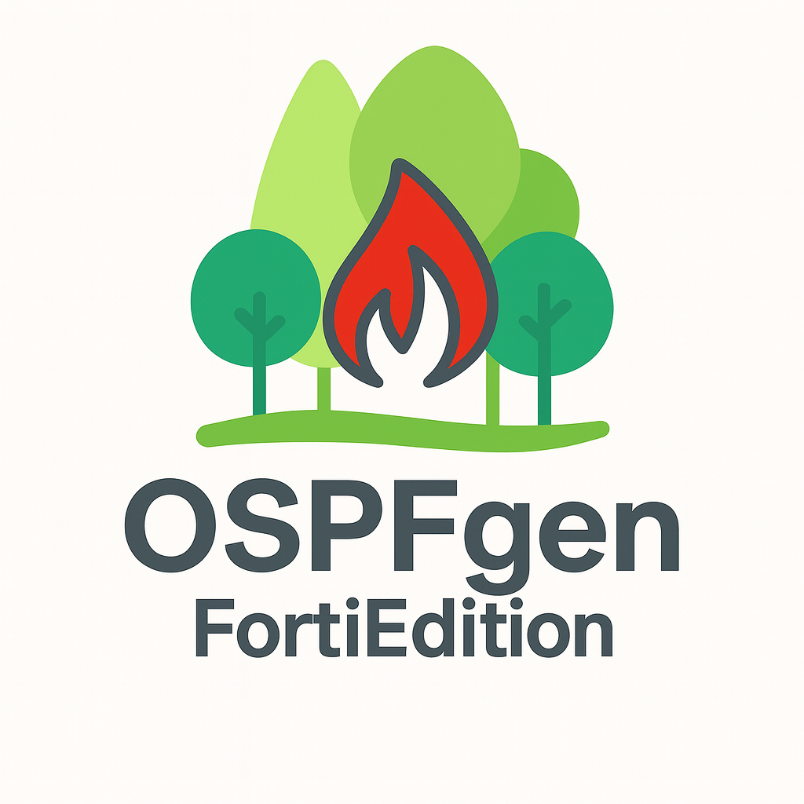

# Fortinet OSPF Configuration Generator




A Python tool for generating optimized OSPF configurations for Fortigate firewalls with intelligent route summarization to reduce OSPF table size and improve network efficiency.

## Features

- **Advanced Route Summarization**: Dual-phase algorithm achieving 62-75% route reduction
- **FortiOS CLI Output**: Generates native Fortigate configuration syntax
- **Multiple Input Formats**: Supports both standard and simple configuration formats
- **Interface Configuration**: Cost, authentication, passive mode, and priority settings
- **Efficiency Validation**: Ensures meaningful route reduction before creating summaries

## Quick Start

### Basic Usage

```bash
# Basic usage with default output filename
python ospf_generator.py ospf-networks.txt

# Specify custom output filename  
python ospf_generator.py ospf-networks.txt custom-config.txt
```

### Input File Format

Create an input file (e.g., `ospf-networks.txt`) with the following format:

```
OSPF Router ID: 192.168.1.1
Areas: 0.0.0.0

Interfaces
Name: internal
Interface: port1  
Cost: 10
Authentication: none
Passive: disabled

192.168.1.0/24
192.168.2.0/24
10.0.1.0/24
10.0.2.0/24
```

## Architecture

The generator follows a clear pipeline pattern:

1. **Parse**: `OSPFConfigParser` processes input files
2. **Optimize**: `NetworkSummarizer` applies intelligent route summarization  
3. **Generate**: `FortigateConfigGenerator` produces FortiOS CLI syntax

### Route Summarization Algorithm

**Phase 1 - Major Network Summarization**:
- Groups networks by major boundaries (/8, /16, /24)
- Uses hierarchical processing to prevent conflicts
- Only creates summaries when multiple networks exist in the same block

**Phase 2 - Contiguous Block Detection**:
- Processes remaining networks using `ipaddress.collapse_addresses()`
- Applies efficiency validation (prevents summaries larger than /28)
- Ensures meaningful route reduction

### Data Models

- **OSPFInterface**: Interface configuration with cost, authentication, passive mode
- **OSPFConfig**: Container for router ID, areas, networks, and interfaces

## Output Structure

Generated configurations include:

- Router ID and OSPF area definitions
- Network statements using summarized prefixes
- OSPF interface configurations
- Summary address advertisements for LSA optimization
- Detailed summarization report showing efficiency gains

## Example Output

```
config router ospf
    set router-id 192.168.1.1
    config area
        edit 0.0.0.0
        next
    end
    config network
        edit 1
            set prefix 192.168.0.0/16
            set area 0.0.0.0
        next
        edit 2
            set prefix 10.0.0.0/24
            set area 0.0.0.0
        next
    end
    config summary-address
        edit 1
            set prefix 192.168.0.0/16
        next
    end
end
```

## Requirements

- Python 3.6+
- Standard library only (no external dependencies)

## License

MIT License - see LICENSE file for details.

## Contributing

1. Fork the repository
2. Create a feature branch
3. Make your changes
4. Add tests if applicable
5. Submit a pull request

## Examples

See the included example files:
- `ospf-networks-example.txt` - Sample input file
- `fortigate-ospf-networks-config.txt` - Sample output